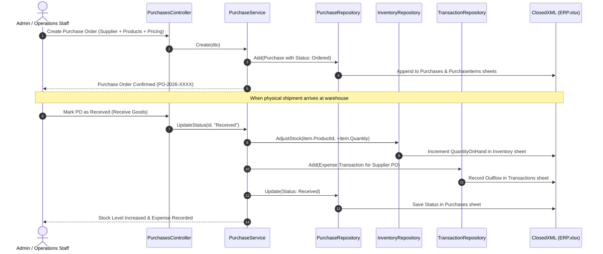
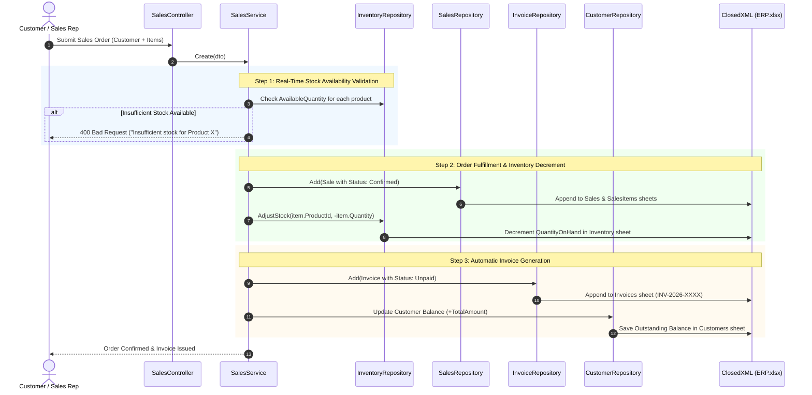
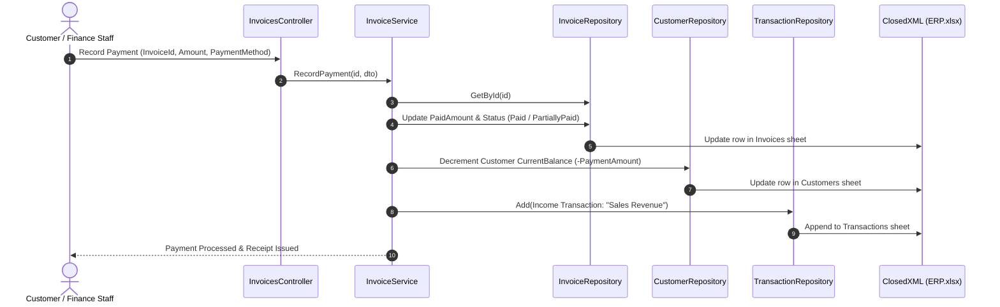
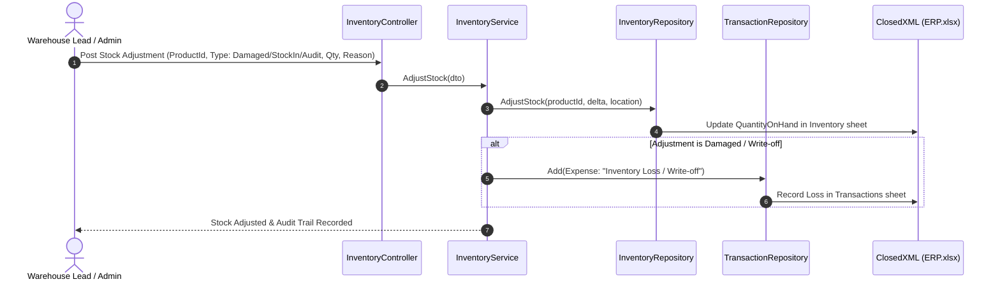

# Core ERP Business Workflows

## 1. Purchase & Procurement Workflow

---

## 2. Sales Order & Automatic Invoicing Workflow

---

## 3. Invoice Settlement & Payment Workflow

---

## 4. Manual Stock Adjustment & Audit Workflow

